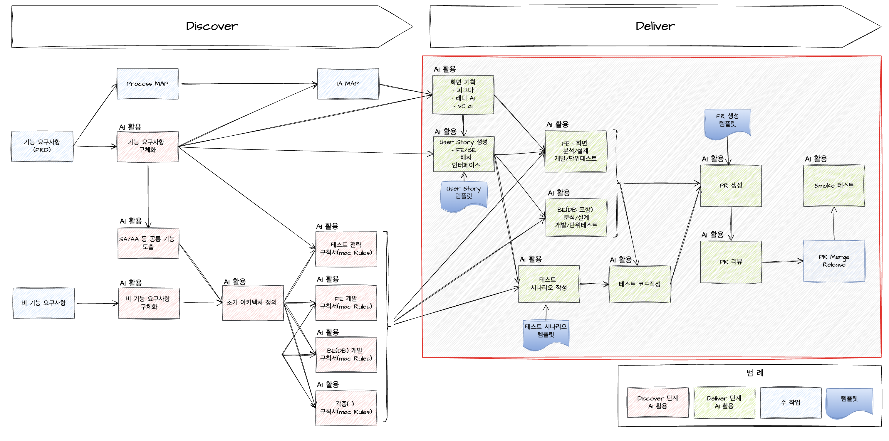

# Deliver 단계에서 Planning & Design 과정

## Deliver 단계에서 AI 활용 설명

Deliver 단계에서는 구체화된 기능 요구사항, IA(Information Architecture) Map, 테스트 전략 규칙서, FE 개발 규칙서(mdc Rules), BE(DB) 개발 규칙서(mdc Rules) 등 산출물을 기반으로 화면 User Story 작성, 분석, 설계, 개발, 테스트 등 다양한 업무에 AI를 활용하여 생산성을 높일 수 있습니다. 또한 개발이 완료된 후에는 PR 생성 및 PR 리뷰 과정에서도 AI를 적극적으로 활용할 수 있습니다.

AI의 기능이 아직 사람을 완전히 대체할 수준에 이르지 않았기 때문에, AI로부터 불안정하거나 오류가 있는 소스 코드가 생성될 수 있습니다. 따라서 개발자는 최종적으로 AI의 도움을 받더라도 반드시 소스 코드와 동작을 직접 확인해야 합니다.

Deliver 단계에서의 Planning, UX Design, 테스트 시나리오 작성 과정은 아래와 같이 진행됩니다.

### 1. Planning (계획 수립)

- **기능 요구사항 구체화:** 앞서 수집된 비즈니스 요구사항과 사용자 니즈를 바탕으로, 실제로 구현해야 할 기능을 상세하게 정리합니다.
- **우선순위 결정:** 각 기능의 비즈니스적 중요도, 개발 난이도, 예상 리스크를 고려해 구현 순서 및 목표 일정을 계획합니다.
- **리소스 배정:** 개발, 디자인, 테스트 등 각 영역별 담당자와 리소스를 할당하고, 산출물이 언제, 어떻게 만들어질지 일정을 수립합니다.

### 2. UX Design (설계)

- **화면 설계/프로토타입:** User Story 기반으로 와이어프레임 또는 프로토타입을 만들고, 서비스 흐름과 UI/UX를 구체화합니다.

### 3. 테스트 시나리오 작성

- **User Story 기반 테스트 케이스 도출:** 각 User Story나 요구사항마다 정상/비정상 상황을 포괄하는 테스트 케이스를 상세히 만듭니다.
- **테스트 데이터 설계:** 테스트에 필요한 입력 값, 예상 결과 등 상세 정보를 함께 기록합니다.
- **자동화 테스트 계획(필요 시):** 반복적인 테스트는 자동화 도구 적용 여부와 방식을 함께 계획합니다.

이러한 과정을 거치면 Deliver 단계에서 산출되는 모든 결과물(설계서, 프로토타입, 테스트케이스 등)을 체계적으로 만들 수 있으며, 이후 개발 및 검수 단계에서 원활하게 참고할 수 있습니다. AI는 각 과정에서 문서 작성, 아이디어 제안, 케이스 자동생성 등 다양한 방식으로 생산성을 높일 수 있습니다.

## 기타 관련 자료

!!! warning "AI Coding 위협"
    - AI 코딩 도구, 프로덕션 데이터베이스 삭제하고 사용자 4,000명 조작하고 흔적 은폐 위해 거짓말 : [https://cybernews.com/ai-news/replit-ai-vive-code-rogue/](https://cybernews.com/ai-news/replit-ai-vive-code-rogue/)