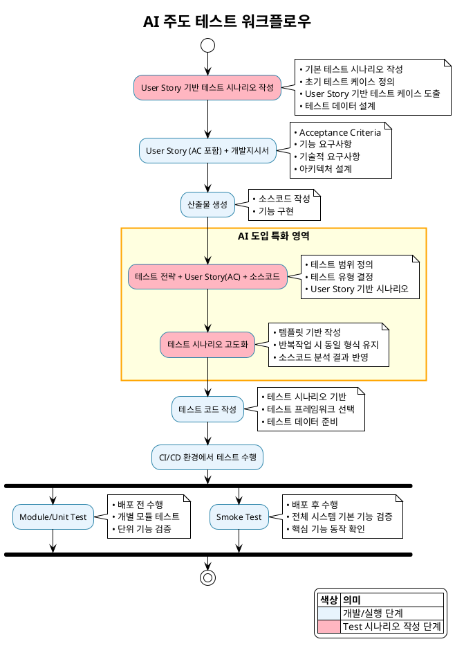

# User Story 기반 Test 시나리오 작성

## 1. 범용적인 프롬프트 작성 팁

### 1.1 프롬프트 구조화 원칙

**CLEAR 프롬프트 모델**

!!! quote ""
    - C - Context (맥락): 프로젝트 배경과 목적 명시
    - L - Length (길이): 원하는 출력물의 상세도 지정
    - E - Examples (예시): 구체적인 예시나 샘플 제공
    - A - Audience (대상): 누구를 위한 것인지 명시
    - R - Role (역할): AI에게 부여할 역할 정의


**효과적인 프롬프트 작성 단계**

- 1단계: 맥락 설정
```
"나는 Agile 프로세스 기반 프로젝트의 SQE(Software Quality Engineer)입니다. 
현재 [프로젝트명]의 테스트 시나리오를 작성하고 있습니다."
```

- 2단계: 구체적 요구사항 명시
```
"다음 요구사항을 바탕으로 테스트 시나리오를 작성해주세요:
- 프로젝트: [프로젝트 설명]
- 아키텍처: [기술 스택]
- 테스트 범위: [단위/통합/E2E]
- 특별 고려사항: [보안, 성능, 접근성 등]"
```

- 3단계: 출력 형식 지정
```
"다음 형식으로 작성해주세요:
- 테스트 케이스 ID: [TC-XXX-XXX]
- 입력 데이터: [구체적 데이터]
- 예상 결과: [명확한 결과]
- 검증 항목: [체크리스트 형태]"
```

### 1.2 프롬프트 작성 체크리스트

**필수 포함 요소**

!!! quote ""
    - 프로젝트 배경 및 목적
    - 대상 기술 스택
    - 테스트 범위 및 레벨
    - 원하는 출력 형식
    - 특별 고려사항 (보안, 성능 등) 
    - 예상 품질 기준

**프롬프트 최적화 팁**

!!! quote ""
    - 구체성: "좋은 테스트" → "70% 커버리지 목표의 단위 테스트"
    - 구조화: 단계별로 나누어 요청
    - 예시 제공: 원하는 결과물의 샘플 포함
    - 역할 명시: "테스트 아키텍트로서" 같은 역할 부여

### 1.3 일반적인 프롬프트 패턴

**패턴 1: 분석 요청**

```
"다음 [요구사항/코드/아키텍처]를 분석하여 
[테스트 전략/시나리오/케이스]를 제안해주세요.
특히 [특정 관점]에 중점을 두어 분석해주세요."
```

**패턴 2: 템플릿 생성**

```
"[프로젝트 유형]에 적합한 [테스트 템플릿]을 만들어주세요.
다음 요소들을 포함해주세요:
1. [요소1]
2. [요소2]
3. [요소3]"
```

**패턴 3: 검증 요청**

```
"작성된 [테스트 시나리오/전략]을 검토하여 
다음 관점에서 개선점을 제안해주세요:
- 완성도
- 실용성
- 커버리지
- 유지보수성"
```

## 2. 테스트 시나리오 템플릿 생성 프롬프트

### 2.1 템플릿 생성 프롬프트 예시

```
나는 Agile 프로세스 기반 프로젝트의 SQE입니다. 
다음 프로젝트 정보를 바탕으로 테스트 시나리오 템플릿을 생성해주세요:

프로젝트 정보:
- 프로젝트명: [프로젝트명]
- 아키텍처: [백엔드/프론트엔드 기술 스택]
- 테스트 전략: [테스트 피라미드 구조]
- 품질 기준: [커버리지 목표, 성능 기준 등]

요구사항:
[요구사항 목록 또는 링크]

다음 형식으로 템플릿을 작성해주세요:
1. 단위 테스트 섹션 (Service/Component 레벨)
2. 모듈 테스트 섹션 (Controller/API 레벨)
3. 통합 테스트 섹션 (시스템 간 연동)
4. E2E 테스트 섹션 (사용자 시나리오)

각 테스트 케이스는 다음 요소를 포함해야 합니다:
- 테스트 케이스 ID (TC-XXX-XXX 형식)
- 테스트 케이스명 (기능 중심)
- 입력 데이터 (구체적 값)
- 예상 결과 (명확한 결과)
- 검증 항목 (체크리스트)

특별 고려사항:
- 실제 소스 코드 기반으로 작성
- 테스트 격리 전략 포함
- 예외 케이스 포함
- 비즈니스 로직 검증 중심
```

### 2.2 템플릿 커스터마이징 프롬프트

```
기존 템플릿을 다음 요구사항에 맞게 수정해주세요:

수정 요구사항:
- [추가할 테스트 레벨]
- [변경할 테스트 도구]
- [새로운 품질 기준]
- [특정 비즈니스 도메인 고려사항]

기존 템플릿의 장점은 유지하면서 
다음 요소들을 개선해주세요:
1. [개선 요소 1]
2. [개선 요소 2]
3. [개선 요소 3]
```

### 2.3 템플릿 검증 프롬프트

```
다음 테스트 시나리오 템플릿을 검토하여 
완성도와 실용성을 평가해주세요:

평가 기준:
- 완성도: 모든 테스트 레벨 포함 여부
- 실용성: 실제 프로젝트 적용 가능성
- 확장성: 다른 프로젝트 재사용 가능성
- 명확성: 이해하기 쉬운 구조

개선 제안사항도 함께 제시해주세요.
```


## 3. AI 주도 테스트 워크 플로우

