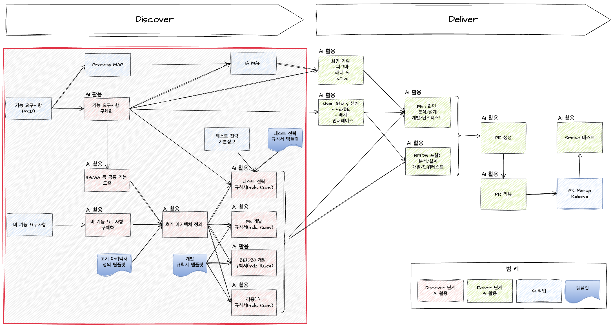

# Discover: PRD 기반 분석/설계 과정

## Discover 단계에서 AI 활용 설명

Discover 단계에서는 사업부서(PO)의 요구사항을 바탕으로 기능 요구사항을 구체화하고, 테스트 전략 규칙서(mdc Rules) 등 주요 산출물을 작성할 수 있어야 합니다. 특히, 기능 요구사항 내 ‘공통기능’과 ‘비기능 요구사항’을 도출하고 이를 기반으로 초기 아키텍처를 수립합니다. 이후 테스트 전략 규칙서(mdc Rules), FE 개발 규칙서(mdc Rules), BE(DB) 개발 규칙서(mdc Rules) 등 다양한 산출물을 작성하게 되며, 이렇게 정리된 산출물은 Deliver 단계의 핵심 입력 자료로 활용됩니다.

AI는 이 과정에서 요구사항 정리, 산출물 초안 작성, Best Practice 추천 등 다양한 업무에 활용되어 생산성과 품질을 높일 수 있습니다.

