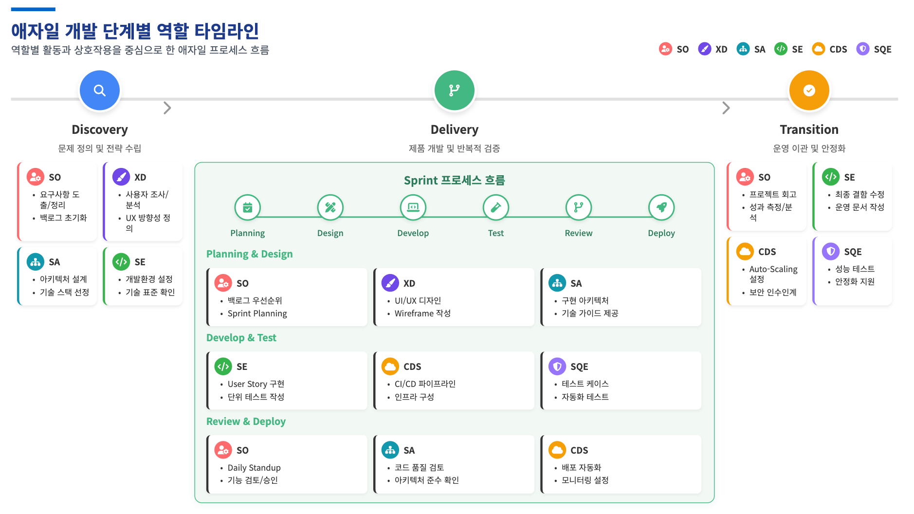

## 1-1. Agile 개발 방법론 개요

Agile 은 고객 중심, 반복적·점진적 개발, 그리고 변화 수용이라는 세 가지 핵심 가치를 기반으로 합니다.

- **핵심 가치:**
    - **고객 중심:** 고객과의 지속적인 협업과 피드백을 통해 가치를 창출하고 제품을 개선합니다.
    - **반복적·점진적 개발:** 2-4주의 짧은 개발 주기(스프린트)를 통해 작동하는 제품을 점진적으로 전달하며 지속적으로 개선합니다.
    - **변화 수용:** 정해진 계획을 따르기보다 변화에 유연하게 대응하는 것을 중요시합니다.
- **핵심 프로세스:**
    - **스프린트(Sprint):** 2-4주 단위의 개발 주기로, 매 주기마다 실제 출시 가능한 제품의 일부를 만듭니다.
    - **데일리 스크럼(Daily Scrum):** 매일 15분간 진행 상황을 공유하고 이슈를 빠르게 파악하는 짧은 미팅입니다.
    - **회고(Retrospective):** 스프린트가 끝난 후, 팀이 더 나은 방향으로 나아가기 위해 개선점을 논의하는 시간입니다.

## 1-2. 스크럼 프레임워크와 Agile 실천법

Agile 핵심 원칙을 실현하기 위한 구체적인 프레임워크로 스크럼이 사용됩니다.

- **Agile 4대 핵심 원칙:**
    1. 프로세스나 도구보다 **개인과 상호작용**
    2. 포괄적인 문서보다 **작동하는 소프트웨어**
    3. 계약 협상보다 **고객과의 협력**
    4. 계획을 따르기보다 **변화에 대응**
- **스크럼 프레임워크 구성 요소:**
    - **역할:**
        - **제품 책임자 (PO, Product Owner):** 제품의 비전과 우선순위를 결정합니다.
        - **스크럼 마스터 (Scrum Master):** 팀이 스크럼을 잘 수행하도록 돕는 조력자입니다.
        - **개발팀 (Development Team):** 실제 제품을 개발하는 전문가 그룹입니다.
    - **산출물:**
        - **제품 백로그:** 개발해야 할 모든 기능 및 요구사항 목록입니다.
        - **스프린트 백로그:** 하나의 스프린트 동안 개발할 작업 목록입니다.
        - **제품 증분:** 스프린트 결과로 나온 실제 작동하는 제품의 일부입니다.
    - **이벤트 (세레모니):** 스프린트 계획, 데일리 스크럼, 스프린트 리뷰, 회고 등 모든 이벤트는 정해진 시간 내에 진행됩니다.

## 1-3. Agile 개발 3단계 흐름

Agile 개발은 크게 Discovery, Delivery, Transition의 3단계로 진행됩니다.

1. **Discovery (발견): 문제 정의 및 전략 수립**
    - 요구사항 도출 및 분석
    - 사용자 조사 및 페르소나 정의
    - MVP(최소 기능 제품) 정의 및 출시 계획 수립
    - 리스크 식별 및 관리
2. **Delivery (전달): 제품 개발 및 검증**
    - 스프린트 계획 및 우선순위 설정
    - 사용자 스토리(User Story) 생성 및 관리
    - 프로토타입 개발 및 기능 구현
    - 테스트 자동화 및 품질 검증
3. **Transition (전환): 운영 이관 및 안정화**
    - 운영 전환 계획 수립 및 실행
    - 운영 매뉴얼 작성 및 운영팀 교육
    - 성능/부하 테스트 및 보안 점검
    - 안정화 지원 및 성과 분석

## 1-4. Agile 주요 역할 상세

Agile 팀은 다음과 같은 다양한 전문가들로 구성되며, 각 역할은 프로젝트 성공에 핵심적인 기여를 합니다.

### **1) SO (Solution Owner) - 솔루션 오너**

Agile 제품 개발 환경에서 스크럼 팀을 리딩하고 스크럼 마스터 역할을 수행하는 핵심 팀원입니다.

- **주요 책임 (SPEC):**
    - **고객 접점 관리:** PO와의 직접적인 소통을 통해 모든 비즈니스 요건을 정리하고 사용자 스토리(User Story)로 변환합니다.
    - **스크럼 세레모니 리딩:** Daily Stand-up, Sprint Planning, Sprint Review 및 Retrospective 미팅을 리딩합니다.
    - **팀 설계 및 구축:** 프로젝트를 리딩하고 방향성을 제시하며 스크럼 팀의 Cadence를 유지합니다.
    - **요구사항 관리:** MVP를 정의하고, 요구사항을 명확히 하여 User Story 작성 및 관리를 통해 개발 우선순위를 설정합니다.
- **단계별 역할 및 세부 Task:**
    - **Discovery:** 비전/요구사항 정의, 전략 수립 (Target 분석, 요구사항 도출, 리스크 관리, Theme/Epic/Backlog 도출, Release Plan 수립 등)
    - **Delivery:** 개발 범위 및 우선순위 수립, 품질 검증 (백로그/우선순위 관리, Sprint Planning 주도, User Story 생성, Blocker 관리 및 해소)
    - **Transition:** 운영 이관, 안정화 지원, 성과 분석 (전환 계획, 교육, 운영 매뉴얼, 프로젝트 종료 회고 및 성과 분석)

### **2) XD (Experience Designer) - 경험 디자이너**

UX 전략, 기획, 디자인을 아우르는 Full-Stack Designer로서, 사용자가 목적 있는 경험을 효율적으로 할 수 있도록 제품과 사용자 간의 상호작용을 설계합니다.

- **주요 책임 (SPEC):**
    - **사용자 중심의 문제 정의:** 페르소나, 시나리오 등을 활용하여 사용자 관점에서 문제를 구조화하고 요구사항 정제를 주도합니다.
    - **UX 전략 수립:** 고객 여정 맵(Journey Map), Task Flow 등을 통해 사용자 경험 전략과 서비스 방향성을 제시합니다.
    - **UX/UI 및 프로토타이핑:** IA Map, 와이어프레임, UI 컴포넌트 등을 제작하고 빠른 프로토타입을 통해 사용성을 검증합니다.
    - **사용자 피드백 기반 개선:** 사용성 테스트, 인터뷰 등 정성적/정량적 피드백을 수집 및 분석하여 디자인을 반복적으로 개선합니다.
- **단계별 역할 및 세부 Task:**
    - **Discovery:** 서비스 방향 정의 및 Product 이해도 정렬 (사용자 조사, Process Map/IA Map 작성, Wireframe 및 동작 가능한 Prototype 제작)
    - **Deliver:** 화면 설계 및 UI 디자인 수행 (디자인 결과물 Handoff, 개발 결과물 리뷰 및 Sign Off, 사용성 점검 및 디자인 품질 확인)
    - **Transition:** 디자인 산출물 정리 및 인계 (디자인 산출물 정리 및 문서화, 자산 전달, 최종 인수인계 지원)

### **3) SA (Solution Architect) - 솔루션 아키텍트**

시스템의 전체적인 아키텍처를 설계하고 기술적 방향성을 제시하며, 비즈니스 요구사항을 기술적 솔루션으로 구현하는 핵심 기술 리더입니다.

- **주요 책임 (SPEC):**
    - **아키텍처 설계 및 관리:** 전체 시스템 아키텍처 설계 및 문서화, 기술 스택 선정, 아키텍처 원칙 및 가이드라인을 수립합니다.
    - **기술적 의사결정 리더십:** 핵심 기술을 결정하고, 기술 부채(Technical Debt)를 관리하며, 비기능적 요구사항(성능, 보안 등)을 정의합니다.
    - **개발팀 기술 지원:** 개발팀을 대상으로 아키텍처 교육 및 멘토링을 제공하고, 코드 리뷰를 통해 아키텍처 준수 여부를 검토합니다.
    - **품질 및 표준 관리:** 개발 표준 및 프로세스를 수립하고, 품질 지표를 정의하여 모니터링합니다.
- **단계별 역할 및 세부 Task:**
    - **Discovery:** 아키텍처 비전 수립, 기술 전략 정의 (비즈니스 요구사항 분석, 기술 환경 분석, 기술 스택 선정 및 검증, 아키텍처 프로토타입 개발)
    - **Deliver:** 아키텍처 구현 가이드, 품질 보증 (상세 아키텍처 설계서 작성, 스프린트별 아키텍처 리뷰, 기술적 블로커 해결, 성능 테스트 가이드)
    - **Transition:** 운영 아키텍처 안정화, 기술 이관 (운영 환경 아키텍처 최적화, 시스템 모니터링 및 알람 설정, 장애 대응 매뉴얼 작성, 아키텍처 교훈 정리)

### **4) SE (Solution Engineer) - 솔루션 엔지니어**

스크럼 팀에서 사용자 스토리를 기반으로 실제 제품을 설계하고 개발하는 Full-stack 개발자로서, 개발 전 영역을 아우르며 제품의 기능 구현 및 품질 확보를 책임집니다.

- **주요 책임 (SPEC):**
    - **기술 역량:** 다양한 언어와 프레임워크를 활용한 기능 구현, 단위/자동화 테스트 작성, API 설계 및 DB 모델링을 수행합니다.
    - **업무 수행 역량:** 사용자 스토리 분석, 기능 개선 및 리팩토링, 스프린트 목표 기반의 일정 계획을 수립합니다.
    - **커뮤니케이션 및 협업 역량:** 스크럼을 통해 진행 상황을 공유하고, 타 직군(SO, SA, XD 등)과 원활하게 협업합니다.
    - **Agile 마인드셋 & 태도:** 변경되는 요구사항에 유연하게 대응하고, 피드백을 신속히 반영하며, 지속적으로 학습합니다.
- **단계별 역할 및 세부 Task:**
    - **Discovery:** 프로젝트 수행 준비 (Local 개발 환경 설정, 아키텍처 및 기술 표준 확인, 협업 툴 학습)
    - **Deliver:** 코드 구현 및 테스트 코드 작성 (User Story 분석 및 구현, 단위/모듈/스모크 테스트 작성, PR 및 코드 리뷰, 데모)
    - **Transition:** 지식 이전 및 문서화, 운영 인계 (운영팀 대상 교육, 유지보수 가이드 정리, 최종 결함 수정, 문서화 작업)

### **5) CDS (Cloud, DevOps, Security) - 클라우드, 데브옵스, 보안 전문가**

Cloud, DevOps, Security 세 영역을 책임지며, 조직의 디지털 인프라 전반에 걸친 안정성, 효율성, 보안을 보장하는 핵심 지원 역할을 수행합니다.

- **주요 책임 (SPEC):**
    - **클라우드 인프라:** 코드 기반(IaC)의 자동화된 인프라 환경을 구성하고 관리합니다.
    - **DevOps 프로세스:** CI/CD 파이프라인을 구축하고 최적화합니다.
    - **보안 관리:** 애플리케이션 취약점 스캔, 컨테이너 보안 진단 등 보안 체계를 구축합니다.
    - **보조 수행 역할:** SA, SE가 필요로 하는 기술 도구 및 실행 환경을 지원하고, 전체 시스템의 원활한 운영을 위한 기술적 조언을 제공합니다.
- **단계별 역할 및 세부 Task:**
    - **Discovery:** 인프라 분석 및 설계 (인프라/리소스 요구사항 분석, 네트워크/보안 구성 설계, IaC 코드 템플릿 준비, CI/CD 방향성 기획)
    - **Deliver:** 인프라 구축 및 연동 (Kubernetes, DB 등 인프라 세팅, CI/CD 파이프라인 구성, 모니터링/로깅 도구 연동, Secrets 관리 체계 적용)
    - **Transition:** 운영 안정화 및 모니터링 (성능 테스트 환경 구축, Auto-Scaling 구성, Cut-Over Plan 지원, 롤백 절차 자동화, 운영/보안 인수인계)

### **6) SQE (Solution Quality Engineer) - 솔루션 품질 엔지니어**

제품의 품질 기준을 충족하고 요구사항에 부합하는 기능을 제공하기 위해, 개발 전 단계에 참여하여 품질 문제를 조기에 발견하고 해결하는 software 품질 보증 전문가입니다.

- **주요 책임 (SPEC) 및 필요 역량:**
    - **기술 역량:** User Story 기반 테스트 케이스 분석/작성, 테스트 자동화 기술(Playwright, Cypress, Postman,Junit 등) 및 코드 작성, 테스트 자동화에 대한 CI/CD 파이프라인 연동 능력이 필요합니다.
    - **도메인 및 프로세스 역량:** BDD/TDD에 대한 이해 및 다양한 테스트 방식(Unit, Module, Smoke)에 대한 이해가 필요합니다.
    - **소프트 스킬:** 명확한 커뮤니케이션, 논리적 문제 해결 능력, 디테일 지향성, 주도적인 태도 및 협업 능력이 중요합니다.
- **단계별 역할 및 세부 Task:**
    - **Discovery:** 테스트 전략 & 환경 준비 (초기 테스트 전략 수립, 테스트 도구 선정, 자동화 테스트 가이드 작성, CI/CD 구축 협업)
    - **Deliver:** 지속적인 품질 검증 & 테스트 자동화 구현 및 관리 (테스트 케이스 작성 및 자동화 코드 구현, 코드 리뷰 참여, 버그 리포팅 및 검증)
    - **Transition:** 배포 전 최종 품질 확인, 운영 환경에서의 품질 모니터링 (성능 테스트 준비 협업, 소스보안 취약점 검증 협업, 소스 품질 점검 협업, 제3자 테스트 협업, 운영 환경 안정화 지원)

## 1-5. Agile 개발 단계별 역할

### 별첨

- Agile 소개 with GenSpark: <https://fpdvrxmy.gensparkspace.com/>
- File 첨부: [Agile Introduction](../attachments/doc-agile-introduction.pdf)
